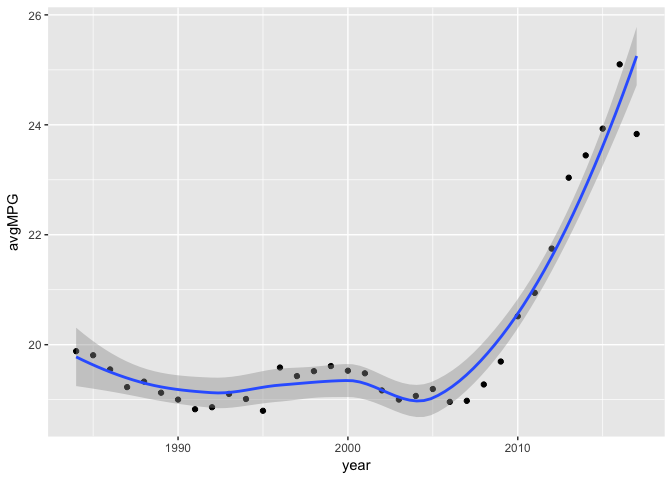
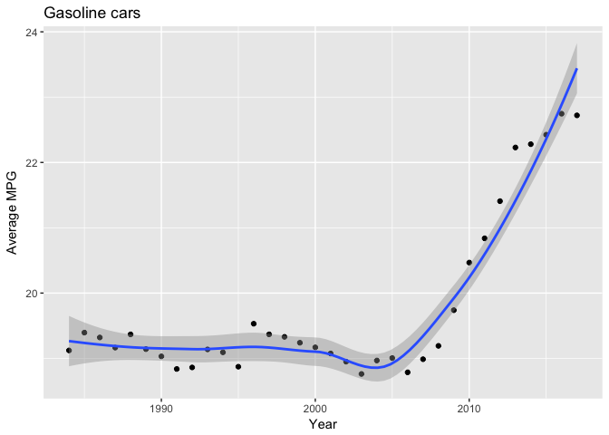
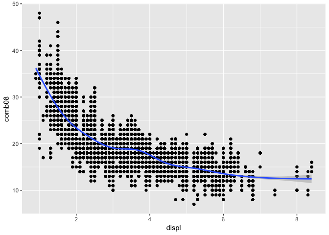
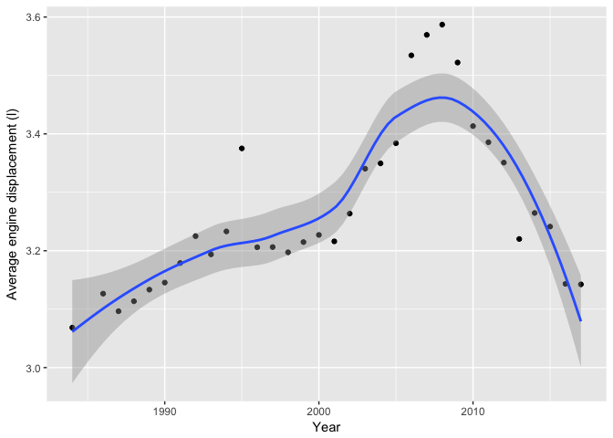
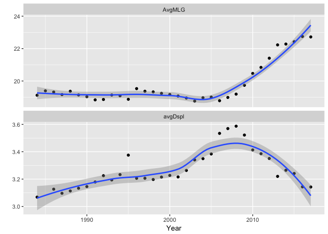

# Visual Analysis with Automobile data
Gunjan Sood  


## Analyzing Automobile data through R

In this project I will be using some of the common R packages like PLYR and GGPLOT to analyze automobile data.

Step 1: To load and examine the data


```
## Warning: package 'ggplot2' was built under R version 3.3.2
```

Step 2: Examine the first few rows to get a sense of the data

```r
str(vehicles)
```

```
## 'data.frame':	38003 obs. of  83 variables:
##  $ barrels08      : num  15.7 30 12.2 30 17.3 ...
##  $ barrelsA08     : num  0 0 0 0 0 0 0 0 0 0 ...
##  $ charge120      : num  0 0 0 0 0 0 0 0 0 0 ...
##  $ charge240      : num  0 0 0 0 0 0 0 0 0 0 ...
##  $ city08         : int  19 9 23 10 17 21 22 23 23 23 ...
##  $ city08U        : num  0 0 0 0 0 0 0 0 0 0 ...
##  $ cityA08        : int  0 0 0 0 0 0 0 0 0 0 ...
##  $ cityA08U       : num  0 0 0 0 0 0 0 0 0 0 ...
##  $ cityCD         : num  0 0 0 0 0 0 0 0 0 0 ...
##  $ cityE          : num  0 0 0 0 0 0 0 0 0 0 ...
##  $ cityUF         : num  0 0 0 0 0 0 0 0 0 0 ...
##  $ co2            : int  -1 -1 -1 -1 -1 -1 -1 -1 -1 -1 ...
##  $ co2A           : int  -1 -1 -1 -1 -1 -1 -1 -1 -1 -1 ...
##  $ co2TailpipeAGpm: num  0 0 0 0 0 0 0 0 0 0 ...
##  $ co2TailpipeGpm : num  423 808 329 808 468 ...
##  $ comb08         : int  21 11 27 11 19 22 25 24 26 25 ...
##  $ comb08U        : num  0 0 0 0 0 0 0 0 0 0 ...
##  $ combA08        : int  0 0 0 0 0 0 0 0 0 0 ...
##  $ combA08U       : num  0 0 0 0 0 0 0 0 0 0 ...
##  $ combE          : num  0 0 0 0 0 0 0 0 0 0 ...
##  $ combinedCD     : num  0 0 0 0 0 0 0 0 0 0 ...
##  $ combinedUF     : num  0 0 0 0 0 0 0 0 0 0 ...
##  $ cylinders      : int  4 12 4 8 4 4 4 4 4 4 ...
##  $ displ          : num  2 4.9 2.2 5.2 2.2 1.8 1.8 1.6 1.6 1.8 ...
##  $ drive          : chr  "Rear-Wheel Drive" "Rear-Wheel Drive" "Front-Wheel Drive" "Rear-Wheel Drive" ...
##  $ engId          : int  9011 22020 2100 2850 66031 66020 66020 57005 57005 57006 ...
##  $ eng_dscr       : chr  "(FFS)" "(GUZZLER)" "(FFS)" "" ...
##  $ feScore        : int  -1 -1 -1 -1 -1 -1 -1 -1 -1 -1 ...
##  $ fuelCost08     : int  1550 2950 1200 2950 2100 1500 1300 1350 1250 1300 ...
##  $ fuelCostA08    : int  0 0 0 0 0 0 0 0 0 0 ...
##  $ fuelType       : chr  "Regular" "Regular" "Regular" "Regular" ...
##  $ fuelType1      : chr  "Regular Gasoline" "Regular Gasoline" "Regular Gasoline" "Regular Gasoline" ...
##  $ ghgScore       : int  -1 -1 -1 -1 -1 -1 -1 -1 -1 -1 ...
##  $ ghgScoreA      : int  -1 -1 -1 -1 -1 -1 -1 -1 -1 -1 ...
##  $ highway08      : int  25 14 33 12 23 24 29 26 31 30 ...
##  $ highway08U     : num  0 0 0 0 0 0 0 0 0 0 ...
##  $ highwayA08     : int  0 0 0 0 0 0 0 0 0 0 ...
##  $ highwayA08U    : num  0 0 0 0 0 0 0 0 0 0 ...
##  $ highwayCD      : num  0 0 0 0 0 0 0 0 0 0 ...
##  $ highwayE       : num  0 0 0 0 0 0 0 0 0 0 ...
##  $ highwayUF      : num  0 0 0 0 0 0 0 0 0 0 ...
##  $ hlv            : int  0 0 19 0 0 0 0 0 0 0 ...
##  $ hpv            : int  0 0 77 0 0 0 0 0 0 0 ...
##  $ id             : int  1 10 100 1000 10000 10001 10002 10003 10004 10005 ...
##  $ lv2            : int  0 0 0 0 0 0 0 0 0 0 ...
##  $ lv4            : int  0 0 0 0 14 15 15 13 13 13 ...
##  $ make           : chr  "Alfa Romeo" "Ferrari" "Dodge" "Dodge" ...
##  $ model          : chr  "Spider Veloce 2000" "Testarossa" "Charger" "B150/B250 Wagon 2WD" ...
##  $ mpgData        : chr  "Y" "N" "Y" "N" ...
##  $ phevBlended    : chr  "false" "false" "false" "false" ...
##  $ pv2            : int  0 0 0 0 0 0 0 0 0 0 ...
##  $ pv4            : int  0 0 0 0 90 88 88 89 89 89 ...
##  $ range          : int  0 0 0 0 0 0 0 0 0 0 ...
##  $ rangeCity      : num  0 0 0 0 0 0 0 0 0 0 ...
##  $ rangeCityA     : num  0 0 0 0 0 0 0 0 0 0 ...
##  $ rangeHwy       : num  0 0 0 0 0 0 0 0 0 0 ...
##  $ rangeHwyA      : num  0 0 0 0 0 0 0 0 0 0 ...
##  $ trany          : chr  "Manual 5-spd" "Manual 5-spd" "Manual 5-spd" "Automatic 3-spd" ...
##  $ UCity          : num  23.3 11 29 12.2 21 ...
##  $ UCityA         : num  0 0 0 0 0 0 0 0 0 0 ...
##  $ UHighway       : num  35 19 47 16.7 32 ...
##  $ UHighwayA      : num  0 0 0 0 0 0 0 0 0 0 ...
##  $ VClass         : chr  "Two Seaters" "Two Seaters" "Subcompact Cars" "Vans" ...
##  $ year           : int  1985 1985 1985 1985 1993 1993 1993 1993 1993 1993 ...
##  $ youSaveSpend   : int  -1500 -8500 250 -8500 -4250 -1250 -250 -500 0 -250 ...
##  $ guzzler        : chr  "" "T" "" "" ...
##  $ trans_dscr     : chr  "" "" "SIL" "" ...
##  $ tCharger       : logi  NA NA NA NA TRUE NA ...
##  $ sCharger       : chr  "" "" "" "" ...
##  $ atvType        : chr  "" "" "" "" ...
##  $ fuelType2      : chr  "" "" "" "" ...
##  $ rangeA         : chr  "" "" "" "" ...
##  $ evMotor        : chr  "" "" "" "" ...
##  $ mfrCode        : chr  "" "" "" "" ...
##  $ c240Dscr       : chr  "" "" "" "" ...
##  $ charge240b     : num  0 0 0 0 0 0 0 0 0 0 ...
##  $ c240bDscr      : chr  "" "" "" "" ...
##  $ createdOn      : chr  "Tue Jan 01 00:00:00 EST 2013" "Tue Jan 01 00:00:00 EST 2013" "Tue Jan 01 00:00:00 EST 2013" "Tue Jan 01 00:00:00 EST 2013" ...
##  $ modifiedOn     : chr  "Tue Jan 01 00:00:00 EST 2013" "Tue Jan 01 00:00:00 EST 2013" "Tue Jan 01 00:00:00 EST 2013" "Tue Jan 01 00:00:00 EST 2013" ...
##  $ startStop      : chr  "" "" "" "" ...
##  $ phevCity       : int  0 0 0 0 0 0 0 0 0 0 ...
##  $ phevHwy        : int  0 0 0 0 0 0 0 0 0 0 ...
##  $ phevComb       : int  0 0 0 0 0 0 0 0 0 0 ...
```

I like to use str instead of Head. It is more concise specially when loading in data set which has lot of columns


```r
nrow(vehicles)
```

```
## [1] 38003
```

```r
ncol(vehicles)
```

```
## [1] 83
```

Since we are only doing an analysis on Automatic vs Manual transmission, we would like to manipulate our data to represent it as such :-

STEP 1: Take out missing values
STEP 2: Substring the trany column to get only Auto or Manual


```r
vehicles$trany[vehicles$trany==" "] <- NA
vehicles$trany2 <- ifelse(substr(vehicles$trany,1,4)=="Auto","Auto","Manual")
table(vehicles$trany2)
```

```
## 
##   Auto Manual 
##  25596  12407
```

Step 3: Once the initial analysis is done it is time to start asking the questions.

'How MPG changes over time on average ?'

-> Apply ddply function to get mpgByYear

```r
mpgByYear <- ddply(vehicles,~year,summarise,avgMPG=mean(comb08),avgHwy=mean(highway08))
```

-> Plot the Mileage By year using GGplot2

```r
MpgByYear<-ggplot(mpgByYear,aes(year,avgMPG))+geom_point()+geom_smooth()
```

## Including Plots


```
## `geom_smooth()` using method = 'loess'
```

<!-- -->

This is interesting, there has been tremendous increase in Mileage the last few years. Could it be that there were lot of non-gasoline cars or hybrid cars. Lets look at a similar view but just with gasoline cars


```r
table(vehicles$fuelType1)
```

```
## 
##            Diesel       Electricity Midgrade Gasoline       Natural Gas 
##              1012               122                77                60 
##  Premium Gasoline  Regular Gasoline 
##             10263             26469
```

```r
gasCars <- subset(vehicles,fuelType1 %in% c("Regular Gasoline", "Premium Gasoline", "Midgrade Gasoline") & fuelType2 == "" & atvType != "Hybrid")
mpgByYear_Gas <- ddply(gasCars,~year,summarise,avgMPG_Gas=mean(comb08))
mpgByYear_Gas<-ggplot(mpgByYear_Gas,aes(year,avgMPG_Gas))+geom_point()+geom_smooth()+ xlab("Year") + ylab("Average MPG") + ggtitle("Gasoline cars")
```

## Including Plots


```
## `geom_smooth()` using method = 'loess'
```

<!-- -->

May be it could be that few larger engine cars were made in recent years. Thus what we are essentially saying is large engine cars have less mileage. Lets test that out !

```
## `geom_smooth()` using method = 'gam'
```

```
## Warning: Removed 2 rows containing non-finite values (stat_smooth).
```

```
## Warning: Removed 2 rows containing missing values (geom_point).
```

<!-- -->
The relationship is clear, there is negative correlation between mileage and number of engines in car

Now lets test if smaller engine cars were built in later years which would explain the sudden increase in mileage


```
## `geom_smooth()` using method = 'loess'
```

```
## Warning: Removed 1 rows containing non-finite values (stat_smooth).
```

```
## Warning: Removed 1 rows containing missing values (geom_point).
```

<!-- -->

Clearly there was a dip, now lets bring the two graphs together by using facets


```
## `geom_smooth()` using method = 'loess'
```

```
## Warning: Removed 1 rows containing non-finite values (stat_smooth).
```

```
## Warning: Removed 1 rows containing missing values (geom_point).
```

<!-- -->
