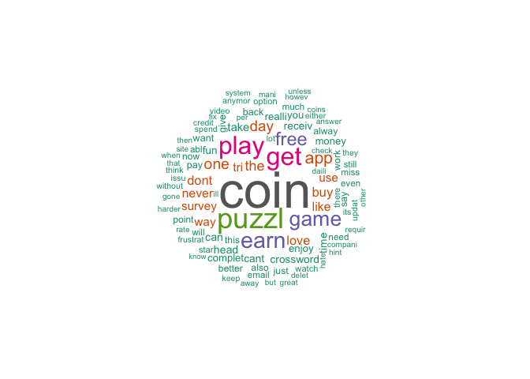

# Daily Celebrity Crossword Analysis


## Analyzing user reviews on App store

In this project I will be using dplyr and ggplot to analyze the sentiment of users playing DCC 

## Step 1 - Import dataset and summarize data

```
## Loading required package: NLP
```

```
## 
## Attaching package: 'NLP'
```

```
## The following object is masked from 'package:ggplot2':
## 
##     annotate
```

```
## Loading required package: RColorBrewer
```

```
## 
## Attaching package: 'data.table'
```

```
## The following objects are masked from 'package:reshape2':
## 
##     dcast, melt
```


```r
summary(DCC_data)
```

```
##     Source               Date               Title          
##  Length:500         Min.   :2016-10-31   Length:500        
##  Class :character   1st Qu.:2016-11-07   Class :character  
##  Mode  :character   Median :2016-11-17   Mode  :character  
##                     Mean   :2016-11-14                     
##                     3rd Qu.:2016-11-22                     
##                     Max.   :2016-11-23                     
##    Content              Name               Rating        Version         
##  Length:500         Length:500         Min.   :1.000   Length:500        
##  Class :character   Class :character   1st Qu.:3.000   Class :character  
##  Mode  :character   Mode  :character   Median :4.000   Mode  :character  
##                                        Mean   :3.954                     
##                                        3rd Qu.:5.000                     
##                                        Max.   :5.000                     
##   Device       
##  Mode:logical  
##  NA's:500      
##                
##                
##                
## 
```

```r
str(DCC_data)
```

```
## 'data.frame':	500 obs. of  8 variables:
##  $ Source : chr  "Daily Celebrity Crossword - Free Crossword Puzzles" "Daily Celebrity Crossword - Free Crossword Puzzles" "Daily Celebrity Crossword - Free Crossword Puzzles" "Daily Celebrity Crossword - Free Crossword Puzzles" ...
##  $ Date   : Date, format: "2016-11-23" "2016-11-23" ...
##  $ Title  : chr  "Awesome App!!!" "Fun" "Daily fun" "Love it!" ...
##  $ Content: chr  "The only thing I wish was different was that you could play past games for free or for just one coin." "Good puzzles but too hard to obtain coins." "Not too easy, not too hard. I like it." "Lot's of fun." ...
##  $ Name   : chr  "Mugsy1972" "Jbf73" "Louys53" "Z's girl" ...
##  $ Rating : int  5 3 5 5 3 4 3 4 5 5 ...
##  $ Version: chr  "4.11.4" "4.11.4" "4.11.4" "4.11.4" ...
##  $ Device : logi  NA NA NA NA NA NA ...
```

## Step 2: Calculate average rating by month

```r
AvgRating <- ddply(DCC_data,~Date,summarise,avgRating=mean(Rating))
plotAvgRating <- ggplot(AvgRating,aes(Date,avgRating))+geom_point()+geom_smooth()+ggtitle("Avg Rating over 23 days")
```


```
## `geom_smooth()` using method = 'loess'
```

<!-- -->

## Step 3: Doing some sentiment analysis by Date


```
##         Date Positive Addictive Negative Neutral
## 1 2016-10-31        6         1        0       1
## 2 2016-11-01        8         0        1       3
## 3 2016-11-02       10         0        0       0
## 4 2016-11-03        3         0        0       1
## 5 2016-11-04        6         1        0       0
## 6 2016-11-05        7         1        1       2
```

## Step 4: Analyzing trend of Postive vs Negative review side by side

```r
DCC_sentiment_melt <- melt(DCC_sentiment,id="Date")
plotSentiment<-qplot(Date,value,data=DCC_sentiment_melt,geom="line",colour=variable,main = "Sentiment Analysis",ylab="# of reviews",xlab="Date")
plotSentiment<- plotSentiment+scale_color_manual(values=c("#13ef5c", "#38d5ea", "#ed6868","#edbe68"))
```

<!-- -->

## Step 5: Analyze Rating trend

```r
count_rating <- ddply(DCC_data,.(Rating,Date),summarise,CountRating=length(Source))

RatingTrend <- ggplot(count_rating,aes(Rating,CountRating,fill=Rating))+geom_bar(stat="identity")+geom_smooth()+facet_wrap(~Date)
plot(RatingTrend)
```

```
## `geom_smooth()` using method = 'loess'
```

<!-- -->


##Step 6: Analyzing neutral and negative reviews by building a word cloud

```r
DCCNegative<-DCC_data[DCC_data$Rating<=2,]
DCCCorpus <- Corpus(VectorSource(DCCNegative$Content))
DCCCorpus <- tm_map(DCCCorpus, content_transformer(function(x) iconv(x, to='UTF-8-MAC', sub='byte')),mc.cores=1)
DCCCorpus <- tm_map(DCCCorpus, PlainTextDocument)
DCCCorpus <- tm_map(DCCCorpus, removePunctuation)
DCCCorpus <- tm_map(DCCCorpus, removeWords, c('the', 'this', stopwords('english')))
DCCCorpus <- tm_map(DCCCorpus, stemDocument)
wordcloud(DCCCorpus, max.words = 100, random.order = FALSE,colors = brewer.pal(8, "Dark2"))
```

<!-- -->

This analysis tells me that lot of users are unhappy about Coins specifically earning free coins. Plus they would like to see more than one puzzle
