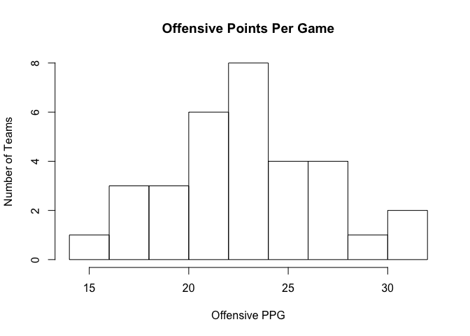
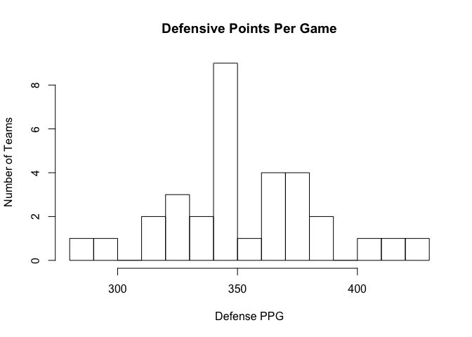
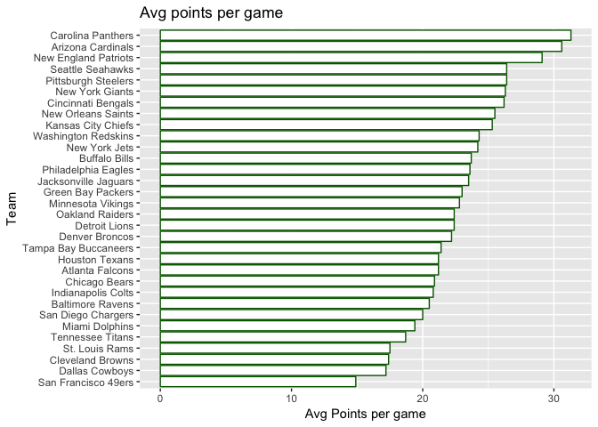
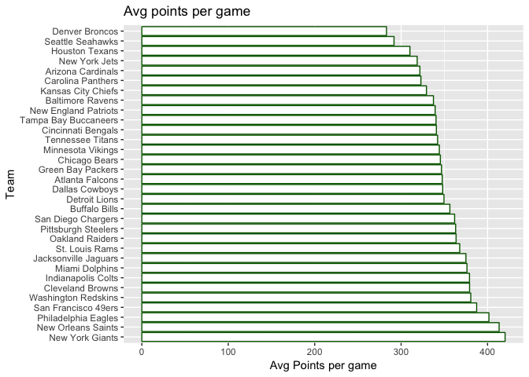
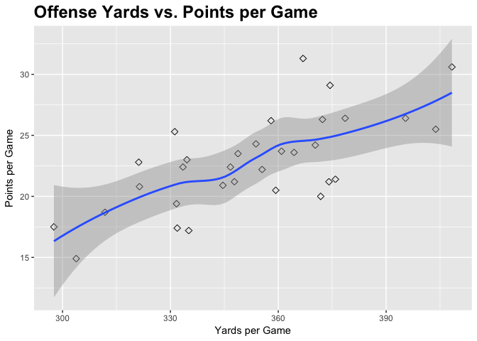
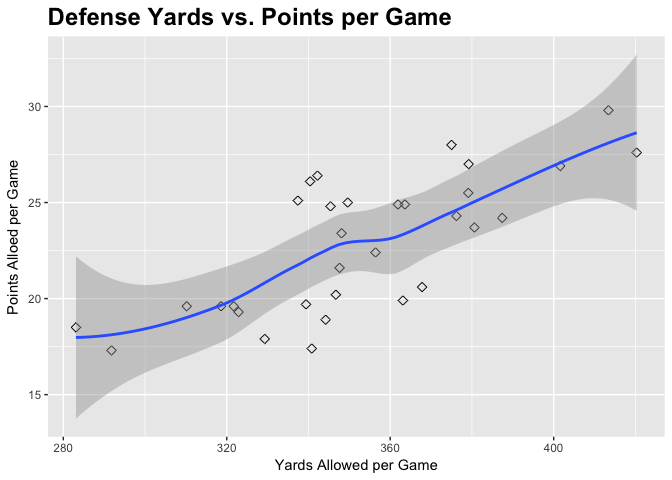

# NFL


## Simulation Analysis to decide the winner between two NFL teams


```
## 
## The downloaded binary packages are in
## 	/var/folders/2s/zhpb9qr51133td9gryrfvwzm0000gn/T//RtmpKLk1sU/downloaded_packages
```

```
## 
##   There is a binary version available but the source version is
##   later:
##         binary source needs_compilation
## RSQLite  1.0.0    1.1              TRUE
```

```
## installing the source package 'RSQLite'
```

```
## 
## The downloaded binary packages are in
## 	/var/folders/2s/zhpb9qr51133td9gryrfvwzm0000gn/T//RtmpKLk1sU/downloaded_packages
```

```
## 
## The downloaded binary packages are in
## 	/var/folders/2s/zhpb9qr51133td9gryrfvwzm0000gn/T//RtmpKLk1sU/downloaded_packages
```

```
## Loading required package: DBI
```

```
##                   Team   G  Pts/G  Yds/G  PassYds/G  RushYds/G  1stD/G 
## 1    Carolina Panthers  16   31.3  366.9      224.3      142.6    22.3 
## 2    Arizona Cardinals  16   30.6  408.3      288.5      119.8    23.3 
## 3 New England Patriots  16   29.1  374.4      286.7       87.8    21.7 
## 4     Seattle Seahawks  16   26.4  378.6      236.9      141.8    20.9 
## 5  Pittsburgh Steelers  16   26.4  395.4      287.7      107.8    20.7 
## 6      New York Giants  16   26.3  372.3      271.7      100.6    20.7 
##   3rdM  3rdD%  4thM  4thD%  Pen  PYds    TOP 
## 1   86   42.4     6   60.0  103   887  32:03 
## 2   93   47.0     4   44.4   94   758  32:03 
## 3   88   40.9     9   60.0   96   859  30:17 
## 4   99   46.5     8   88.9  117  1007  32:14 
## 5   75   38.9     4   33.3   94   868  29:42 
## 6   82   37.8     9   56.3  102   779  28:29
```

Step 2: After inspecting the table, we see there are some blank columns plus the classes of these columns are factors. We need to change that

```r
offense <- offense[,-c(2,4,6,8,10,12,14,16,18,20,22,24,26,28)]
offense[,1] <- as.character(offense[,1])
offense[,2:13] <- apply(offense[,2:13],2,as.numeric)
offense[,14] <- as.numeric(substr(offense[,14], 1, 2))*60 + as.numeric(substr(offense[,14], 4, 6))
head(offense)
```

```
##                   Team  G Pts/G Yds/G PassYds/G RushYds/G 1stD/G 3rdM
## 1    Carolina Panthers 16  31.3 366.9     224.3     142.6   22.3   86
## 2    Arizona Cardinals 16  30.6 408.3     288.5     119.8   23.3   93
## 3 New England Patriots 16  29.1 374.4     286.7      87.8   21.7   88
## 4     Seattle Seahawks 16  26.4 378.6     236.9     141.8   20.9   99
## 5  Pittsburgh Steelers 16  26.4 395.4     287.7     107.8   20.7   75
## 6      New York Giants 16  26.3 372.3     271.7     100.6   20.7   82
##   3rdD% 4thM 4thD% Pen PYds  TOP
## 1  42.4    6  60.0 103  887 1923
## 2  47.0    4  44.4  94  758 1923
## 3  40.9    9  60.0  96  859 1817
## 4  46.5    8  88.9 117 1007 1934
## 5  38.9    4  33.3  94  868 1782
## 6  37.8    9  56.3 102  779 1709
```

Next step in this project would be to build up a roaster and run the simulation to decide the winner.

Step 3: Now we will repeat the steps for defense

```r
url <- paste("http://sports.yahoo.com/nfl/stats/byteam?group=Defense&cat=Total&conference=NFL&year=season_",year,"&sort=530&old_category=Total&old_group=Defense")
defense <- readHTMLTable(url, encoding = "UTF-8",colClasses="character")[[7]]
defense <- defense[,-c(2,4,6,8,10,12,14,16,18,20,22,24,26)]
defense[,1] <- as.character(defense[,1])
defense[,2:13] <- apply(defense[,2:13],2,as.numeric)
combined <- merge(offense, defense, by.x="Team", by.y="Team")
colnames(combined)[2] <- "Games"
colnames(combined)[3] <- "OffPPG"
colnames(combined)[4] <- "OffYPG"
colnames(combined)[5] <- "OffPassYPG"
colnames(combined)[6] <- "OffRushYPG"
combined$G.y <- NULL
colnames(combined)[15] <- "DefPPG"
colnames(combined)[16] <- "DefYPG"
colnames(combined)[17] <- "DefRushYPG"
colnames(combined)[18] <- "DefPassYPG"
```
## Including Plots


```r
Off_PPG <- hist(combined$OffPPG, breaks=10, main="Offensive Points Per Game", xlab="Offensive PPG",ylab="Number of Teams")
```

<!-- -->

```r
Def_YPG <- hist(combined$DefYPG, breaks=10, main="Defensive Points Per Game", xlab="Defense PPG",ylab="Number of Teams")
```

<!-- -->

Step 4 : Convert table to Dataframe by using the transform function

```r
ppg <- transform(combined,Team=reorder(Team,combined$OffPPG))
ypg <- transform(combined,Team=reorder(Team,-combined$DefYPG))
```

Step 5: Compare Points per game by Team for both Offense and Defense

```r
ggplot(ppg,aes(x=Team,y=OffPPG))+geom_bar(stat="Identity",color="darkgreen",fill="white")+coord_flip()+labs(x="Team",y="Avg Points per game")+ggtitle("Avg points per game")
```

<!-- -->

```r
ggplot(ypg,aes(x=Team,y=DefYPG))+geom_bar(stat="Identity",color="darkgreen",fill="white")+coord_flip()+labs(x="Team",y="Avg Points per game")+ggtitle("Avg points per game")
```

<!-- -->

From these charts, we can get a visual sense osf what fans saw throughout the season, specifically the incredible offense of the Denver Broncos team and the unstoppable defense of the Seattle Seahawks team, which ultimately led them to a Super Bowl victory against the Broncos.


```r
ggplot(combined, aes(x=combined$OffYPG, y=combined$OffPPG)) +
  geom_point(shape=5, size=2) + geom_smooth() + 
  labs(x="Yards per Game",y="Points per Game") + ggtitle("Offense Yards vs. Points per Game") + 
  theme(plot.title = element_text(size=18, face="bold"))
```

```
## `geom_smooth()` using method = 'loess'
```

<!-- -->

```r
ggplot(combined, aes(x=combined$DefYPG, y=combined$DefPPG)) +
  geom_point(shape=5, size=2) + geom_smooth() + 
  labs(x="Yards Allowed per Game",y="Points Alloed per Game") + ggtitle("Defense Yards vs. Points per Game") + 
  theme(plot.title = element_text(size=18, face="bold"))
```

```
## `geom_smooth()` using method = 'loess'
```

<!-- -->

As you can see, these two variables are positively correlated—as yards per game increases, points per game also usually increases.We calculate correlation now


```r
cor(combined$OffYPG,combined$OffPPG)
```

```
## [1] 0.6975223
```

```r
cor(combined$DefYPG,combined$DefPPG)
```

```
## [1] 0.7452462
```

We will now use team level statistics to construct indexes for the offensive and defensive strengths of each team. The offense strength index will depend on the teams' passing and rushing strength, and the defense strength index will depend on the ability of the teams to defend against the pass and the rush. This will allow us compare the different aspects of each team's game to other teams and will let us arrive at a winner and a loser in our simulated games later on.


```r
offense$OPassStrength <- max(offense[,5])-offense[,5]
offense$OPassStrength <- (1-(offense$OPassStrength/max(offense$OPassStrength)))*100
offense$ORushStrength <- max(offense[,6])-offense[,6]
offense$ORushStrength <- (1-(offense$ORushStrength/max(offense$ORushStrength)))*100
offense$OPPGStrength <- max(offense[,3])-offense[,3]
offense$OPPGStrength <- (1-(offense$OPPGStrength/max(offense$OPPGStrength)))*100

offense$OYPGStrength <- max(offense[,4])-offense[,4]
offense$OYPGStrength <- (1-(offense$OYPGStrength/max(offense$OYPGStrength)))*100
offense$OffStrength <- (offense$OPassStrength+offense$ORushStrength+offense$OPPGStrength+offense$OYPGStrength)/4

defense$DPassStrength <- max(defense[,6])-defense[,6]
defense$DPassStrength <- defense$DPassStrength/max(defense$DPassStrength)*100
defense$DRushStrength <- max(defense[,5])-defense[,5]
defense$DRushStrength <- defense$DRushStrength/max(defense$DRushStrength)*100

defense$DPPGStrength <- max(defense[,3])-defense[,3]
defense$DPPGStrength <- defense$DPPGStrength/max(defense$DPPGStrength)*100

defense$DYPGStrength <- max(defense[,4])-defense[,4]
defense$DYPGStrength <- defense$DYPGStrength/max(defense$DYPGStrength)*100

defense$DefStrength <- (defense$DPassStrength+defense$DRushStrength+defense$DPPGStrength+defense$DYPGStrength)/4
```

Step 6: Starting with Game Simulator

```r
home_team <- "Chicago Bears"
away_team <- "New Orleans Saints"

off_game <- subset(offense,Team==home_team | Team==away_team)[,c(1,15,16,19)]
def_game <- subset(defense,Team==home_team | Team==away_team)[,c(1,14,15,18)]
game <- merge(off_game,def_game,by.x="Team",by.y="Team")
game$Net_Pass[game$Team==home_team] <- game$OPassStrength[game$Team==home_team] - game$DPassStrength[game$Team==away_team]
game$Net_Pass[game$Team==away_team] <- game$OPassStrength[game$Team==away_team] - game$DPassStrength[game$Team==home_team]

game$Net_Rush[game$Team==home_team] <- game$ORushStrength[game$Team==home_team] - game$DRushStrength[game$Team==away_team]
game$Net_Rush[game$Team==away_team] <- game$ORushStrength[game$Team==away_team] - game$DRushStrength[game$Team==home_team]
game$Net_Total[game$Team==home_team] <- game$OffStrength[game$Team==home_team] - game$DefStrength[game$Team==away_team]
game$Net_Total[game$Team==away_team] <- game$OffStrength[game$Team==away_team] - game$DefStrength[game$Team==home_team]

game$Net_Total <- game$Net_Pass + game$Net_Rush + game$Net_Total

if(game$Net_Total[game$Team==home_team] >= game$Net_Total[game$Team==away_team]){
  winner <- home_team
  loser <- away_team
}else{
  winner <- away_team
  loser <- home_team
}

print(paste(winner, "beat", loser)) 
```

```
## [1] "Chicago Bears beat New Orleans Saints"
```
